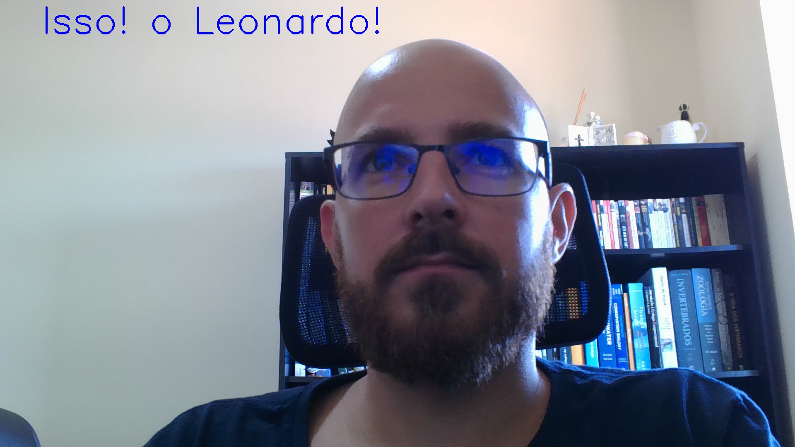
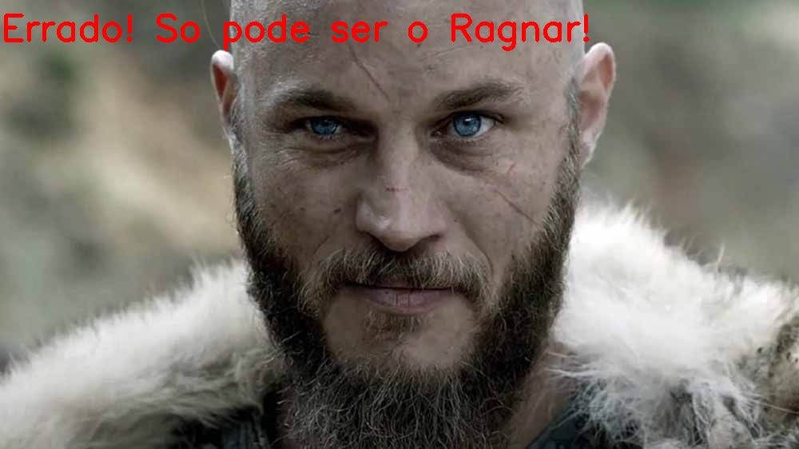

# reconhecimentoFacialLeonardo

Esse é um projeto pessoal para testar a biblioteca __DeepFace__ para reconhecimento facial. Para isso, utilizei a biblioteca __OpenCV__ para manipular as imagens e a biblioteca __DeepFace__ para o reconhecimento da minha face, para saber mais, acesse a pagina do [projeto deepface no github](https://github.com/serengil/deepface).

## Estrutura do projeto

A execução do projeto está detalhada no arquivo [reconhecimentoFacial.ipynb](https://nbviewer.org/github/LeonardoDonatoNunes/reconhecimentoFacialDeepFace/blob/main/reconhecimentoFacialLeonardo.ipynb){target="_blank"} onde o projeto está explicado passo a passo e pode ser executado. O arquivo [reconhecer_leonardo.py](./reconhecer_leonardo.py) foi utilizado para fazer as marcações nas imagens para o REDME, vale a pena conferir 😁!  

    .
    ├── imagens
    │   ├── leonardo1.jpg
    │   ├── leonardo2.jpg
    │   ├── leonardo2_labeled.jpg
    │   ├── minhaFoto.jpg
    │   ├── ragnar.jpg
    │   └── ragnar_labeled.jpg
    ├── README.md
    ├── reconecimentoFacial.ipynb
    ├── reconhecer_leonardo.py
    └── videos
        ├── teste_reconhecimento.gif
        ├── teste_reconhecimento.mp4
        └── teste_reconhecimento_cortado.mp4

### Como testei a biblioteca

Para testar a biblioteca utilizei uma foto minha como referencia e comparei com outra foto minha e com a imagem de outra pessoa.

No primeiro caso, usei uma foto minha (quase a mesma 😒) para ver se o reconhecimento foi feito corretamente.

|||
|:---:|:---:|
|**Fig.1-Imagen de referencia**|**Fig.1-Imagen testada**|

O segundo teste foi usando uma imagem do 🛡️Ragnar⚔️ para comparação com minha foto. O objetivo do sergundo teste foi verifiar se o reconhecimento é capaz de 'acertar' 🤔 ao identificar outra pessoa como Falso. 

|||
|:---:|:---:|
|**Fig.1-Imagen de referencia**|**Fig.1-Imagen testada**|

### Reconhecimento em tempo real

Por fim, testei o algoritmo em tempo real usando a imagem da webcam para detectar se era o Leonardo que estava em frente a câmera.

                

